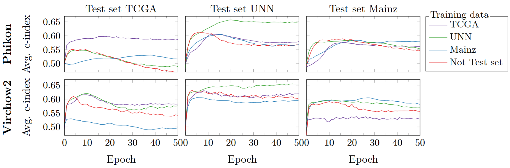
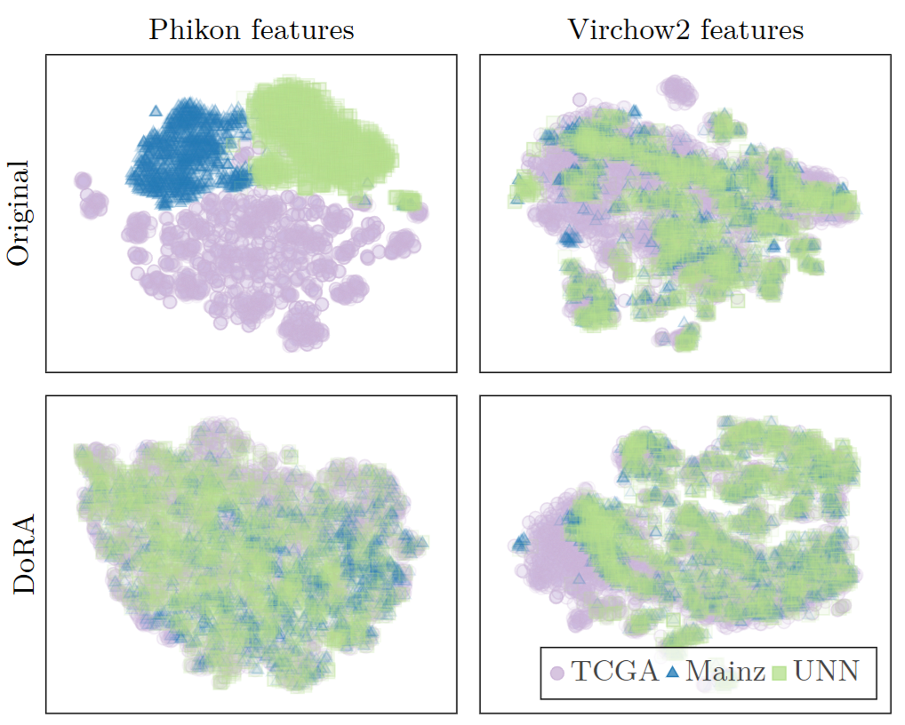
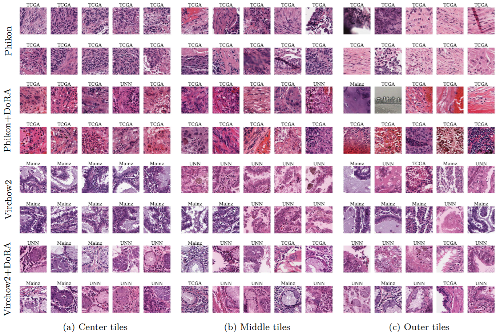

# Motivation
Foundation Models (FMs) have emerged as a popular and promising approach within computational pathology. These models are trained on vast, diverse datasets, and are often expected be more robust and less susceptible to domain shifts than other models. However, recent studies suggest that FMs in histopathology may not generalize to out-of-distribution condition. In this study, we test the robustness of two popular foundation models: Phikon and Virchow 2. We also suggest to use low-rank adaptations to tune the FMs, to increase the generalizability of the FM features.

# Robustness of Foundation Models
To evaluate the robustness of the original FM features, we train an ABMIL model to predict overall survival based on the tile features. We compare the performance of models in internal (ABMIL head trained and tested on the same dataset) versus external (trained on different datasets than tested on) evaluation settings. This is shown in Figure 1, where we observe a drop in performance for external evaluation settings. Since robust features should generalize well across input domains, this observed drop confirms that both Phikon and Virchow2 struggle with robustness in survival prediction.


Figure 1: Evaluating Phikon (top) and Virchow2 (bottom) performance on internal and external datasets. The performance drops when the models are evaluated on external data, suggesting robustness issues. The “Not Test set” refers to training on the union of the two datasets not used as “test set.”

We also plot a dimensionality reduction of features from three different datasets (Figure 2). This shwos a clear clustering of Phikon features according to dataset, which suggests that features from the same dataset are more similar to each other than to those from different datasets; even though the underlying biological characteristics may be more similar across different datasets. This highlights a limitation in the generalizability of the FM features.


Figure 2: t-SNE plots for Phikon and Virchow2 original features (top) and DoRA adapted features tuned on UNN (bottom). The plots show a more clear clustering for the original features, suggesting these features are more dataset dependent. This is an undesired quality for domain generalization.

# DoRA for improved generalization

To tackle this robustness issue, we use a fine-tuning method called Weight-Decomposed Low-Rank Adaptation (DoRA), enhanced with strong data augmentations of the WSI tiles. Our experiments reveal that features created by these tuned FMs display improved generalizability.
Considering each dataset a separate cluster, the tuned feature clusters have a larger spread of features within each cluster, and more overlap between different clusters.
Using a KMeans clustering algorithm on the FM features, we observe that the tuned FM features tend to create clusters containing a more proportionate mix of tiles from different datasets, and include tiles of more different color profiles within the same cluster (Figure 3). This is a good sign of more generalizable features that may consider biological features as more important than dataset dependant information.


Figure 3: WSI tiles that are close to the a cluster center (left), have a medium distance to the center (middle), and are far from the cluster center (right) for Phikon and Virchow2 with and without DoRA-tuning.

## Conclusion

We find that current FMs for histopathology have issues with robustness. Our results indicate that DoRA-tuning with strong augmentations enhances the robustness of FM features by encouraging invariance to staining and scanner differences while keeping biological information. Our findings highlight the need for rigorous robustness testing of FMs and stress the importance of considering these factors during their development and training.


## Citation
```
@inproceedings{SchulerudBoee2025,
  title={Low-Rank Adaptations for increased Generalization in Foundation Model features},
  author={Schulerud B\o{}e, Vilde and Kleppe, Andreas and Foersch, Sebastian and Wagner, Daniel-Christoph and Busund, Lill-Tove Rasmussen and Ram\'irez Rivera, Ad\'in},
  year={2025}
}
```
